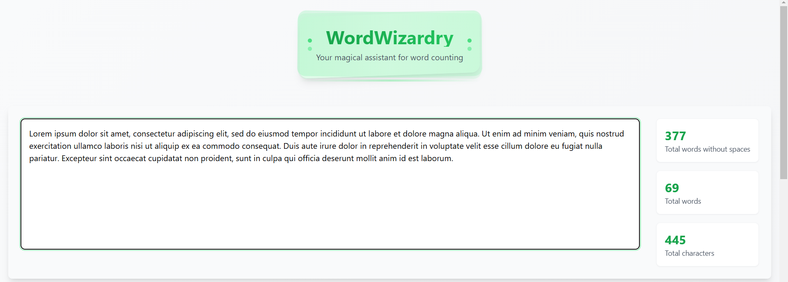
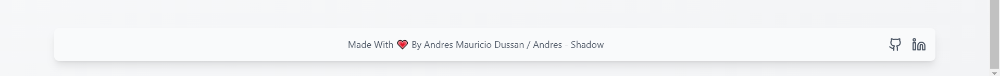

# 🧙‍♂️ WordWizardry

**WordWizardry** is a sleek and magical word counter built with React. Its goal is to **showcase my React development skills** while providing an intuitive tool for analyzing text. 🌟  

## ✨ Features

WordWizardry offers precise text analysis with the following features:  

- 🔢 **Word Count (Excluding Spaces)**: Quickly calculate the number of words in the input text.  
- 📝 **Word Count (Including Spaces)**: Counts every word, including whitespace-separated entries.  
- 🔡 **Character Count**: Total number of characters, perfect for text length validations.  

All calculations are performed instantly as you type, ensuring a smooth and interactive user experience!  

---

## 🛠️ Technologies Used

This project leverages modern tools and best practices for front-end development:  

### **Frontend Core**

- ⚛️ **React**: The core library powering the user interface.  
- 💛 **JavaScript**: The primary programming language.  

### **Styles**

- 🎨 **TailwindCSS**: A utility-first CSS framework for clean and responsive designs.  
- 📱 **Responsive Design**: Ensures the app looks great across devices.  

### **Development**

- ✅ **Best Practices**: Clean and maintainable code for scalability.  
- 🧩 **Component Pattern**: Modular architecture to enhance reusability.  

---

## 📸 Screenshots

Word counter section

Implementd Tech section

Footer section

---

## 💡 Why This Project?

This project was born out of a desire to sharpen my React skills and showcase my expertise in building dynamic and interactive front-end applications. It's also a reflection of my passion for clean, functional design.
